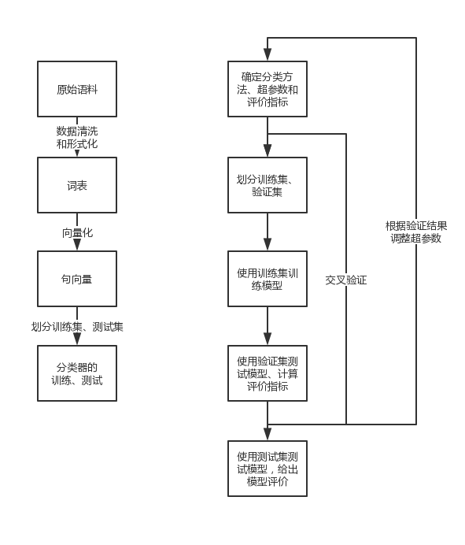

# Simple-Text-Classification

A simple framework for text classification, including the parts of text vectorization, classification and cross validation.

## Run

word2vec/word2vec_model.py must be run before running code/main.py, to generate w2v model. Then code/main.py could be run. Output information includes the confuse matrixs and relevant statistical data.

## Current Work and Future Work

See in [code/README.md](https://github.com/WinterShiver/Simple-Text-Classification/blob/master/code/README.md).

## Directory Description

**function** is where the codes are.
**word2vec** contains w2v models used in learning, which should be generated before the main process.
**data** contains data used in learning, in the form of \*.xlsx.

## Modification Instruction

Only codes from the directory **code** are supposed to be modified.

